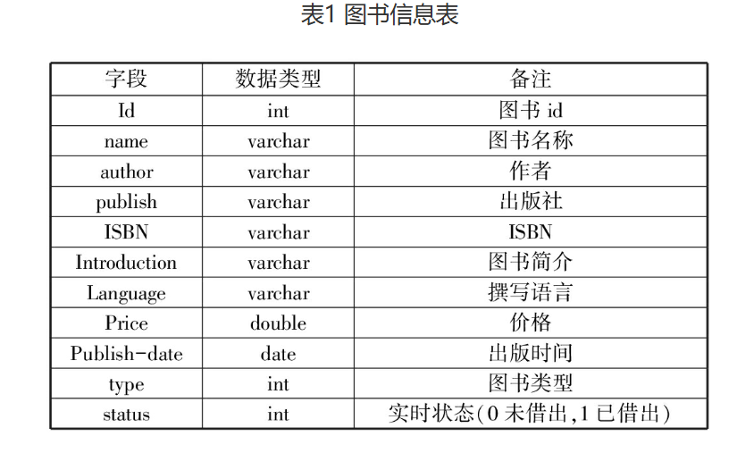

# prompt-design

以写论文为例，一些关于prompt设计技巧和方法

前一段时间在写毕业论文，ChatGPT帮了很大的忙，所以想将使用过程写一篇博客作为记录，也方便后来人可以参考。

这里必须要说一下的是，我是

既然是实践型的学习，就可以直接进入实战了。

首先我们需要选定自己的题目，这里就以“基于SpringBoot的图书管理系统的设计与实现”为例子。

# 目录

现在我们有了题目别的啥都没有，可以自己找网上的论文参考写出大体框架然后让ChatGPT生成，也可以直接让ChatGPT生成框架，这里我们直接让ChatGPT生成。

```xml
<system>
    你需要扮演一位熟悉软件工程和Spring框架开发的大学教授,你需要辅助我完成我的论文。
</system>

<context>
    我现在需要写一篇毕业论文，论文的题目是**基于SpringBoot的图书管理系统的设计与实现**。我希望用到的的技术使用三个方括号分隔[[[Vue+ElementUI(前端)，SpringBoot+SpringMVC+MyBatis(后端)，MySql数据库技术]]]。
</context>

<object>
	给出我论文的目录和大纲，并解释每一小节需要写哪些内容。
</object>
```

[生成内容，在`目录.md`文件中也有-第一次生成](https://chatgpt.com/share/e35cb547-1c94-455a-a4d2-bece095ed25c)

这里的XML的标签可以更好的**分隔不同的内容**，让LLM模型更好的理解prompt。不单单可以使用**XML标签**分隔，可以使用任何符号分隔，例如反引号``````花括号{{{}}}方括号[[[]]]括号((()))HTML语言Json格式等等。但是使用这些符号分隔有时需要说明使用的符号和分隔的内容，语言可能有些啰嗦。

使用XML标签可以很好的处理嵌套，例如我们可以**让ChatGPT帮我们优化**一下这个prompt。就可以使用一个`<prompt>`标签将这些内容括起来，不需要再说明这些prompt使用什么分隔。

```xml
阅读并理解我的prompt，一步一步思考这个prompt有没有什么可以改进的地方
<prompt>
    
</prompt>
```

这个prompt中的**一步一步思考**是一个比较有用的提示词，在处理一些复杂任务需要多步骤处理的时候可以增加准确率，有些时候可能还需要提供步骤和例子，这个之后再说。

这是我们让ChatGPT优化后的新prompt，可以看到新的prompt更具体，尤其是<context>包含了项目的功能，本来我还说让它帮我们生成都有哪些功能后添加进来，看来现在不需要了。

它这里优化后的prompt看起来是一次性生成整个论文的样子，这样生成起来比较困难，还是推荐一节一节生成，但仍然可以参考他的。

> (生成内容)[https://chatgpt.com/share/fad3d1ff-7f12-4b75-95a9-b6161b24dc10]
>
> <system>
>     你需要扮演一位熟悉软件工程和Spring框架开发的大学教授，你需要详细指导我完成我的毕业论文，提供具体的建议和指导。
> </system>
>
> <context>
>     我现在需要写一篇毕业论文，论文的题目是**基于SpringBoot的图书管理系统的设计与实现**。我希望使用的技术栈包括[[[Vue+ElementUI(前端)，SpringBoot+SpringMVC+MyBatis(后端)，MySql数据库技术]]]。
>
> 项目功能需求包括用户登录注册、图书信息管理（增加、删除、修改、查询）、借阅管理等。系统需要有角色区分，普通用户和管理员具有不同的权限。希望论文能详细介绍系统的设计思路、技术选型、实现过程，以及遇到的问题和解决方案。
>
> 论文的预期长度是约1万字，需要包含图表、代码示例和测试结果。
>
> </context>
>
> <object>
>     请给出我的论文目录和大纲，并解释每一小节需要写哪些内容。特别需要包括系统功能需求分析、技术选型理由、详细的设计与实现过程、以及系统测试和性能优化部分。
> </object>

然后我们使用这个ChatGPT修改后的新prompt重新生成一次。

[生成内容，在`目录.md`文件中也有-第三次生成](https://chatgpt.com/share/6759c158-7dde-44bc-a717-6b6b78b20011)

下面这个是我又尝试的一个prompt，就是把`<context>`标签里的内容细化了一下，这三次生成的内容在`目录.md`。

```XML
<system>
    你需要扮演一位熟悉软件工程和Spring框架开发的大学教授,你需要辅助我完成我的论文。
</system>

<context>
    我现在需要写一篇毕业论文，
    <title>
        基于SpringBoot的图书管理系统的设计与实现
    </title>
     <technology>
         Vue+ElementUI(前端)，SpringBoot+SpringMVC+MyBatis(后端)，MySql数据库技术
    </technology>
</context>
<object>
	给出我论文的目录和大纲，并解释每一小节需要写哪些内容。
</object>
```

[生成内容，在`目录.md`文件中也有-第二次生成](https://chatgpt.com/share/5e503a63-232f-4aec-a85c-ac798c6c109d)

# 摘要

现在我们有了论文的目录（在`目录.md`文件中，将之前生成的两个目录根据自己的要求和学校的要求结合一下自己整理出来），然后我们开始生成摘要。

```xml
<system>
    你需要扮演一位熟悉软件工程和SpringBoot框架开发的大学教授，你需要详细指导我完成我的毕业论文，提供具体的建议和指导。
</system>
<context>
    我现在需要写一篇毕业论文，论文的题目是**基于SpringBoot的图书管理系统的设计与实现**。我希望使用的技术栈包括[[[Vue+ElementUI(前端)，SpringBoot+SpringMVC+MyBatis(后端)，MySql数据库技术]]]。
    论文包含9个章节。
    <chapter>
        1.摘要
        2.绪论
        3.系统分析
        4.系统设计
        5.系统实现
        6.系统测试
        7.总结与展望
        8.参考文献
        9.致谢
	</chapter>
    图书管理系统共包含6个功能。
    <function>
        1.用户登录注册：
        2.图书信息管理（增删改查）：
        3.借阅管理：
        4.权限管理：
     	5.用户管理：
        6.日志管理：
    </function>
</context>
<object>
    接下来你需要响应给我论文中##摘要##部分的内容，。
</object>
```

现在我希望在prompt的背景信息中提供系统功能具体作用，但是我们不知道或者是还没有想清除，这时也能用ChatGPT帮我们生成。

在需要将<object>标签中的内容改一下就行。

```XML 
<object>
    帮我想一下这些4个功能的具体信息和作用。
</object>
```

然后ChatGPT就帮我生成了，可以结合这些信息和自己的想法修改填充就行，其实还可以添加很多功能，像日志、用户管理等等，也能一起问它。

[生成系统功能的具体信息](https://chatgpt.com/share/c3bc845e-88bd-4c31-bf9e-3efb9532031c)

```XML
    <function>
        1.用户登录注册：可以通过邮箱注册账号，并在数据库中创建新用户记录，使用账号密码登录。
        2.图书信息管理（增删改查）：管理员对图书的管理，包括数量，图书信息（书名、作者...）等。
        3.借阅管理：用户借阅图书，系统会并更新库存数量；用户归还图书后，系统恢复库存数量。
        4.权限管理：普通用户和管理员具有不同的权限，普通用户只能借书还书，管理员可以管理图书。
        5.用户管理：：管理员可以查看所有注册用户信息和状态；用户可以修改密码查看借书数量等。
        6.日志管理：系统自动记录用户和管理员的操作日志，包括登录、注销、添加/删除/修改图书信息、借阅操作等；管理员可以查看日志。
    </function>
```


接下来我们就能真实生成摘要了，这是完整的生成摘要的prompt。最后的论文需要查重，为了避免重复率过高，可以让生成的内容口语化一些或者带有某种语气来提高个性化。

在<object>标签中还能添加一些自己的要求，比如你自己有一些零散的想法，也能加到里面让生成的内容更加个性化。

```XML
<system>
    你需要扮演一位熟悉软件工程和SpringBoot框架开发的大学教授，你需要详细指导我完成我的毕业论文，提供具体的建议和指导。
</system>
<context>
    我现在需要写一篇毕业论文，论文的题目是**基于SpringBoot的图书管理系统的设计与实现**。我希望使用的技术栈包括[[[Vue+ElementUI(前端)，SpringBoot+SpringMVC+MyBatis(后端)，MySql数据库技术]]]。
    论文包含9个章节。
    <chapter>
        1.摘要
        2.绪论
        3.系统分析
        4.系统设计
        5.系统实现
        6.系统测试
        7.总结与展望
        8.参考文献
        9.致谢
	</chapter>
    图书管理系统共包含6个功能。
    <function>
        1.用户登录注册：可以通过邮箱注册账号，并在数据库中创建新用户记录，使用账号密码登录。
        2.图书信息管理（增删改查）：管理员对图书的管理，包括数量，图书信息（书名、作者...）等。
        3.借阅管理：用户借阅图书，系统会并更新库存数量；用户归还图书后，系统恢复库存数量。
        4.权限管理：普通用户和管理员具有不同的权限，普通用户只能借书还书，管理员可以管理图书。
        5.用户管理：：管理员可以查看所有注册用户信息和状态；用户可以修改密码查看借书数量等。
        6.日志管理：系统自动记录用户和管理员的操作日志，包括登录、注销、添加、删除、修改图书信息、借阅操作等；管理员可以查看日志。
    </function>
</context>
<object>
    接下来你需要响应给我论文中##摘要##部分的内容，结尾需要带有5个关键词。你需要理解并思考我提供的背景信息，查阅相关资料，保证生成内容的原创性性和学术性。
</object>
<tone>
    正式、暴躁老哥
</tone>
```


[生成的摘要，在`摘要.md`中也有](https://chatgpt.com/share/0de1dd7d-981a-4445-aa0c-31fa76314bb8)


现在我们有了中文摘要，还需要英文摘要，直接让ChatGPT帮我们翻译就行，我自己测试发现使用翻译的目标语言和它对话它翻译出来的回更自然一些（测试量很少，比较主观）。然后给他提供的背景信息越多，它翻译出来的也就越自然，我们可以直接在刚才的对话基础上让它翻译，因为它还记得之前提供的有关我们写论文的信息。

在这里需要说明的一点是大语言模型是没有记忆的，虽然我们可以和ChatGPT聊天，看起来它记得我们之前的对话，但事实是我们每次给它发消息都需要将之前的对话也传递给它，或者是将之前对话的总结传递给它（这些事情openai帮我们做了）。

如果是单独的让翻译一段文字，就需要提供更多的背景信息才能更准确。下面prompt中的‘信达雅’这些东西其实可有可无，如果需要节省token可以删掉。

```XML
请将上面你生成的摘要翻译成英文，直接给出翻译后的内容。
遵循“信、达、雅”的原则：
- **信**：忠实于原文意思
- **达**：翻译流畅自然
- **雅**：语言优美
```

翻译成英文：

```XML
Please translate the summary you generated above into English and provide the translated content directly. Follow the principles of "Faithfulness, Expressiveness, and Elegance":
- **Faithfulness**: Stay true to the original meaning
- **Expressiveness**: Ensure the translation is smooth and natural
- **Elegance**: Use beautiful language
```

[翻译的英文摘要，在`摘要.md`中也有](https://chatgpt.com/share/0de1dd7d-981a-4445-aa0c-31fa76314bb8)


# 绪论

3.1 研究背景
3.2 研究目的及意义
3.3 研究内容

下面是生成绪论部分的prompt，这里我们添加了`steps`标签，在这个标签中有让它生成内容的步骤。步骤中有一个让它审查是否有错误，这里是分成合在一起了，更好的做法是将生成的内容提供给一个专门用来审查的ChatGPT（再开一个聊天让，提供一些背景信息让新聊天专门用来审查），这里就简化处理了。

在步骤2中我们可以添加一下自己的见解和个性化的内容，让生成更加符合个性化不会千篇一律。

如果需要生成一些特定格式的内容，可以提供一些例子，让它学习来生成，这个后面会提到。

```xml
<system>
    你需要扮演一位熟悉软件工程和SpringBoot框架开发的大学教授，你需要详细指导我完成我的毕业论文，提供具体的建议和指导。
</system>
<context>
    我现在需要写一篇毕业论文，论文的题目是**基于SpringBoot的图书管理系统的设计与实现**。我希望使用的技术栈包括[[[Vue+ElementUI(前端)，SpringBoot+SpringMVC+MyBatis(后端)，MySql数据库技术]]]。
    论文包含9个章节，使用chapters标签分隔。
    <chaptesrs>
        1.摘要
        2.绪论
        3.系统分析
        4.系统设计
        5.系统实现
        6.系统测试
        7.总结与展望
        8.参考文献
        9.致谢
	</chapters>
    图书管理系统共包含6个功能，使用features标签分隔。
    <features>
        1.用户登录注册：可以通过邮箱注册账号，并在数据库中创建新用户记录，使用账号密码登录。
        2.图书信息管理（增删改查）：管理员对图书的管理，包括数量，图书信息（书名、作者...）等。
        3.借阅管理：用户借阅图书，系统会并更新库存数量；用户归还图书后，系统恢复库存数量。
        4.权限管理：普通用户和管理员具有不同的权限，普通用户只能借书还书，管理员可以管理图书。
        5.用户管理：：管理员可以查看所有注册用户信息和状态；用户可以修改密码查看借书数量等。
        6.日志管理：系统自动记录用户和管理员的操作日志，包括登录、注销、添加、删除、修改图书信息、借阅操作等；管理员可以查看日志。
    </features>
</context>
<object>
    接下来你需要响应给我论文中##绪论-研究背景##部分的内容，保证生成内容的原创性和学术性，语气参考tone标签，步骤参考steps标签，让我们一步一步思考。
</object>
<steps>
    1.理解并思考我提供的背景信息，查阅相关资料。
    2.结合我的论文题目和实现撰写##绪论-研究背景##初稿，可以着重从技术发展、国内外现状等考虑。
    3.审查你初稿是否有事实性错误、抄袭等部分。
    4.根据步骤3的审查修改初稿中的错误。
</steps>
<tone>
    正式、暴躁老哥
</tone>
```

[生成的研究背景，在`绪论.md`中也有](https://chatgpt.com/share/0ee4a5af-3f7e-449c-905b-a98effa61c61)

使用几乎一样的prompt可以继续生成接下来2节，只要修改一下<object>标签中的##的内容和步骤2就行。

```xml
<object>
##绪论-研究目的及意义##
</object>
<steps>
    2.结合我的论文题目和实现撰写##绪论-研究背景##初稿，分成”目的“、”意义“两个小节。可以从智能化、提到效率、数字化等你能想到的其它方面考虑
</steps>
```

[生成的研究目的及意义，在`绪论.md`中也有](https://chatgpt.com/share/4190fa98-aacf-42b4-abcd-416fa5a22c14)

[生成的研究内容，在`绪论.md`中也有](https://chatgpt.com/share/de2af01c-c3ab-4569-a3ca-2e06a189c0b7)

有时候生成的不一定符合要求，可以让它多生成几次结合的来。


# 需求分析

[4.1 功能需求-在`需求分析.md`中也有](https://chatgpt.com/share/85734f76-4f7f-43ac-a8d3-cb38cccd42fc)

[4.2 可行性分析-在`需求分析.md`中也有](https://chatgpt.com/share/7d10ad24-b83d-4329-beb3-fdf8328d618c)

[4.3 非功能性需求-在`需求分析.md`中也有](https://chatgpt.com/share/17be0738-82b1-4d1d-bbc7-d2adaefb0ed5)

使用几乎一样的prompt，只要求改<object>标签和<steps>标签中##分隔的内容就行。

```XML
<system>
    你需要扮演一位熟悉软件工程和SpringBoot框架开发的大学教授，你需要详细指导我完成我的毕业论文，提供具体的建议和指导。
</system>
<context>
    我现在需要写一篇毕业论文，论文的题目是**基于SpringBoot的图书管理系统的设计与实现**。我希望使用的技术栈包括[[[Vue+ElementUI(前端)，SpringBoot+SpringMVC+MyBatis(后端)，MySql数据库技术]]]。
    论文包含9个章节，使用chapters标签分隔。
    <chaptesrs>
        1.摘要
        2.绪论
        3.系统分析
        4.需求分析
        5.系统实现
        6.系统测试
        7.总结与展望
        8.参考文献
        9.致谢
	</chapters>
    图书管理系统共包含6个功能，使用features标签分隔。
    <features>
        1.用户登录注册：可以通过邮箱注册账号，并在数据库中创建新用户记录，使用账号密码登录。
        2.图书信息管理（增删改查）：管理员对图书的管理，包括数量，图书信息（书名、作者...）等。
        3.借阅管理：用户借阅图书，系统会并更新库存数量；用户归还图书后，系统恢复库存数量。
        4.权限管理：普通用户和管理员具有不同的权限，普通用户只能借书还书，管理员可以管理图书。
        5.用户管理：：管理员可以查看所有注册用户信息和状态；用户可以修改密码查看借书数量等。
        6.日志管理：系统自动记录用户和管理员的操作日志，包括登录、注销、添加、删除、修改图书信息、借阅操作等；管理员可以查看日志。
    </features>
</context>
<object>
    接下来你需要响应给我论文中##需求分析-功能需求##部分的内容，保证生成内容的原创性和学术性，语气参考tone标签，步骤参考steps标签，让我们一步一步思考。
</object>
<steps>
    1.理解并思考我提供的背景信息，查阅相关资料。
    2.结合我的论文题目和实现撰写##需求分析-功能需求##初稿。
    3.审查你初稿是否有事实性错误、抄袭等部分。
    4.根据步骤3的审查修改初稿中的错误。
</steps>
<tone>
    正式、暴躁老哥
</tone>
```


# 系统设计

## 总体设计

这里我们可能需要架构图，可以让它使用ASCII码画架构图，在<steps>标签中添加对应的要求就行，也能分两次生成。

这里我分了两次生成（同一个聊天），但是让生成图片的时候效果不太好，最后是提供了两张示例图片后才符合。

生成内容在`总体设计.md`中，带有图片的聊天无法分享链接。

```XML
<system>
    你需要扮演一位熟悉软件工程和SpringBoot框架开发的大学教授，你需要详细指导我完成我的毕业论文，提供具体的建议和指导。
</system>
<context>
    我现在需要写一篇毕业论文，论文的题目是**基于SpringBoot的图书管理系统的设计与实现**。我希望使用的技术栈包括[[[Vue+ElementUI(前端)，SpringBoot+SpringMVC+MyBatis(后端)，MySql数据库技术]]]。
    论文包含9个章节，使用chapters标签分隔。
    <chaptesrs>
        1.摘要
        2.绪论
        3.系统分析
        4.需求分析
        5.系统实现
        6.系统测试
        7.总结与展望
        8.参考文献
        9.致谢
	</chapters>
    图书管理系统共包含6个功能，使用features标签分隔。
    <features>
        1.用户登录注册：可以通过邮箱注册账号，并在数据库中创建新用户记录，使用账号密码登录。
        2.图书信息管理（增删改查）：管理员对图书的管理，包括数量，图书信息（书名、作者...）等。
        3.借阅管理：用户借阅图书，系统会并更新库存数量；用户归还图书后，系统恢复库存数量。
        4.权限管理：普通用户和管理员具有不同的权限，普通用户只能借书还书，管理员可以管理图书。
        5.用户管理：：管理员可以查看所有注册用户信息和状态；用户可以修改密码查看借书数量等。
        6.日志管理：系统自动记录用户和管理员的操作日志，包括登录、注销、添加、删除、修改图书信息、借阅操作等；管理员可以查看日志。
    </features>
</context>
<object>
    接下来你需要响应给我论文中##系统设计-总体设计##部分的内容，保证生成内容的原创性和学术性，语气参考tone标签，步骤参考steps标签，让我们一步一步思考。
</object>
<steps>
    1.理解并思考我提供的背景信息，查阅相关资料。
    2.结合我的论文题目和实现撰写##系统设计-总体设计##初稿。
    3.审查你初稿是否有事实性错误、抄袭等部分。
    4.根据步骤3的审查修改初稿中的错误。
</steps>
<tone>
    正式、暴躁老哥
</tone>
```


## 数据库设计

数据库部分我们需要让它帮忙画出E-R图和数据库表，这里我们如果没有设计好数据库表，可以告诉他我们的需求，然后让它帮我们生成对应的SQL。将之前的prompt修改一下就行，我这里做的比较简单，

```XML
<system>
    你需要扮演一位熟悉软件工程和SpringBoot框架开发的资深软件工程师，你需要详细指导我完成我的**基于SpringBoot的图书管理系统**项目，有关这个项目的具体信息由context标签分隔。
</system>
<context>
    我现在需要实现**基于SpringBoot的图书管理系统**。我希望使用的技术栈包括[[[Vue+ElementUI(前端)，SpringBoot+SpringMVC+MyBatis(后端)，MySql数据库技术]]]。
    图书管理系统共包含6个功能，使用features标签分隔。
    <features>
        1.用户登录注册：可以通过邮箱注册账号，并在数据库中创建新用户记录，使用账号密码登录。
        2.图书信息管理（增删改查）：管理员对图书的管理，包括数量，图书信息（书名、作者...）等。
        3.借阅管理：用户借阅图书，系统会并更新库存数量；用户归还图书后，系统恢复库存数量。
        4.权限管理：普通用户和管理员具有不同的权限，普通用户只能借书还书，管理员可以管理图书。
        5.用户管理：：管理员可以查看所有注册用户信息和状态；用户可以修改密码查看借书数量等。
        6.日志管理：系统自动记录用户和管理员的操作日志，包括登录、注销、添加、删除、修改图书信息、借阅操作等；管理员可以查看日志。
    </features>
	图书管理系统的数据库共有3张表，使用tables标签分隔。
    <tables>
        1.user表：用户信息
        2.book表：图书信息
        3.log表：日志信息
    </tables> 
</context>
<object>
    接下来你需要响应给我生成##user表##的SQL语句和对user表的解释 ，用户表需要包含主键id、用户名、密码、salt、邮箱、状态、创建时间等内容，让我们一步一步思考。
</object>
```

[生成内容-在`数据库设计.md`中也有](https://chatgpt.com/share/9bb96616-8d17-4d6a-97fb-51930e859c8f)

生成的内容不太满意，它只生成了我们列举出来的属性，像存放书籍的信息等等都没有。可以想让他帮我们想出来都有哪些表，这些表都有哪些属性，最后再来生成SQL语句，新的prompt如下。

```XML
<system>
    你需要扮演一位熟悉软件工程和SpringBoot框架开发的资深软件工程师，你需要详细指导我完成我的**基于SpringBoot的图书管理系统**项目，有关这个项目的具体信息由context标签分隔。
</system>
<context>
    我现在需要实现**基于SpringBoot的图书管理系统**。我希望使用的技术栈包括[[[Vue+ElementUI(前端)，SpringBoot+SpringMVC+MyBatis(后端)，MySql数据库技术]]]。
    图书管理系统共包含6个功能，使用features标签分隔。
    <features>
        1.用户登录注册：可以通过邮箱注册账号，并在数据库中创建新用户记录，使用账号密码登录。
        2.图书信息管理（增删改查）：管理员对图书的管理，包括数量，图书信息（书名、作者...）等。
        3.借阅管理：用户借阅图书，系统会并更新库存数量；用户归还图书后，系统恢复库存数量。
        4.权限管理：普通用户和管理员具有不同的权限，普通用户只能借书还书，管理员可以管理图书。
        5.用户管理：：管理员可以查看所有注册用户信息和状态；用户可以修改密码查看借书数量等。
        6.日志管理：系统自动记录用户和管理员的操作日志，包括登录、注销、添加、删除、修改图书信息、借阅操作等；管理员可以查看日志。
    </features>
</context>
<object>
    接下来你需要帮我分析这个项目的数据库该如何设计，都有哪些表，为什么？并解释这些表的作用，让我们一步一步思考。
</object>
```

[生成内容-在`数据库设计.md中也有`](https://chatgpt.com/share/6c077b4d-f897-4967-b783-16dfbfe30c21)

现在我们根据它生成的表结构和信息再来让它写SQL语句。

```XML
<system>
    你需要扮演一位熟悉软件工程和SpringBoot框架开发的资深软件工程师，你需要详细指导我完成我的**基于SpringBoot的图书管理系统**项目，有关这个项目的具体信息由context标签分隔。
</system>

<context>
    我现在需要实现**基于SpringBoot的图书管理系统**。我希望使用的技术栈包括[[[Vue+ElementUI(前端)，SpringBoot+SpringMVC+MyBatis(后端)，MySql数据库技术]]]。
    图书管理系统共包含6个功能，使用features标签分隔。
    <features>
        1.用户登录注册：可以通过邮箱注册账号，并在数据库中创建新用户记录，使用账号密码登录。
        2.图书信息管理（增删改查）：管理员对图书的管理，包括数量，图书信息（书名、作者...）等。
        3.借阅管理：用户借阅图书，系统会并更新库存数量；用户归还图书后，系统恢复库存数量。
        4.权限管理：普通用户和管理员具有不同的权限，普通用户只能借书还书，管理员可以管理图书。
        5.用户管理：：管理员可以查看所有注册用户信息和状态；用户可以修改密码查看借书数量等。
        6.日志管理：系统自动记录用户和管理员的操作日志，包括登录、注销、添加、删除、修改图书信息、借阅操作等；管理员可以查看日志。
    </features>
		图书管理系统的数据库共有6张表，使用tables标签分隔，这些表中不存在外键。
    <tables>
        1.用户表 (User)
        字段：
        id (主键): 用户ID
        email: 用户邮箱
        password: 用户密码
        name: 用户名
        role: 用户角色（非外键）
        created_at: 创建时间
        updated_at: 更新时间
            ---
        2.图书表 (Book)
        字段：
        id (主键): 图书ID
        title: 书名
        author: 作者
        publisher: 出版社
        isbn: 国际标准书号
        quantity: 图书库存数量
        created_at: 创建时间
        updated_at: 更新时间
            ---
        3.借阅记录表 (BorrowRecord)
        字段：
        id (主键): 借阅记录ID
        user_id: 用户ID（非外键，通过应用层管理数据完整性）
        book_id: 图书ID（非外键，通过应用层管理数据完整性）
        borrow_date: 借阅日期
        return_date: 归还日期
        status: 借阅状态（借阅中/已归还）
            ---

        4.日志表 (Log)
        字段：
        id (主键): 日志ID
        user_id: 用户ID（非外键，通过应用层管理数据完整性）
        operation: 操作类型（如：登录、注销、添加图书、删除图书、借阅、归还等）
        description: 操作描述
        timestamp: 操作时间
            ---
        5.权限表 (Role)
        字段：
        id (主键): 权限ID
        role_name: 角色名称（普通用户/管理员）
        description: 角色描述
            ---
        6.用户角色关系表 (UserRole)
        字段：
        user_id: 用户ID（非外键，通过应用层管理数据完整性）
        role_id: 角色ID（非外键，通过应用层管理数据完整性）
    </tables>
</context>
<object>
    阅读理解我提供的背景信息，一步一步思考后接下来你需要响应给我生成这6张表的SQL语句。
</object>
```

[生成内容-在`数据库设计.md中也有`](https://chatgpt.com/share/db22a8f8-ece5-4885-ad74-0f65e12e31f4)

现在我们已经有了数据库的结构和对应的SQL语句（有些错误，需要自己修改）。

我们在论文中可能需要数据库对应的表格，我们自己画表格比较繁琐，也可以让ChatGPT帮我们生成。

直接让它生成表格自己描述比较麻烦，需要告诉它表头等各种信息，最好的做法是直接给他一个示例表格，让它模仿示例生成。

有很多时候生成的内容不太符合要求，就能提供给它少量例子，让它模仿例子来学习，这个就是LLM的小样本学习。

给他示例可以直接给它图片，也能给它markdown格式的表格，我自己测试来看提供markdown形式的的表格效果更好，而且给它发图片是有限制次数的。这里我们找了一张图片，为了提高效果，将它转化成markdown表格。这里有人就要问了，这和我们自己画表格不是一样吗，还是很麻烦。

其实我们将这个图片转化成表格也不需要我们亲自动手，也能让ChatGPT帮我们完成，这里就能看出ChatGPT的强大了，下面我们来试一下将图片转成表格。



```XML
将我提供给你图片中的表格转化成markdown形式的表格，保证原始信息的正确。
```

生成的内容：

> Sure, here is the table from the image converted into Markdown format:
>
> | 字段         | 数据类型 | 备注                          |
> | ------------ | -------- | ----------------------------- |
> | Id           | int      | 图书 id                       |
> | name         | varchar  | 图书名称                      |
> | author       | varchar  | 作者                          |
> | publish      | varchar  | 出版社                        |
> | ISBN         | varchar  | ISBN                          |
> | Introduction | varchar  | 图书简介                      |
> | Language     | varchar  | 撰写语言                      |
> | Price        | double   | 价格                          |
> | Publish-date | date     | 出版时间                      |
> | type         | int      | 图书类型                      |
> | status       | int      | 实时状态 (0 未借出, 1 已借出) |
>
> This table retains all the original information from the provided image.

现在我们有了示例表格，有了SQL语句，就能让它来生成表格了。

```XML
<system>
    你需要扮演一位熟悉软件工程和SpringBoot框架开发的大学教授，你需要详细指导我完成我的毕业论文，提供具体的建议和指导。
</system>
<context>
    我现在需要写一篇毕业论文，论文的题目是**基于SpringBoot的图书管理系统的设计与实现**。我希望使用的技术栈包括[[[Vue+ElementUI(前端)，SpringBoot+SpringMVC+MyBatis(后端)，MySql数据库技术]]]。
    论文包含9个章节，使用chapters标签分隔。
    <chaptesrs>
        1.摘要
        2.绪论
        3.系统分析
        4.需求分析
        5.系统实现
        6.系统测试
        7.总结与展望
        8.参考文献
        9.致谢
	</chapters>
    图书管理系统共包含6个功能，使用features标签分隔。
    <features>
        1.用户登录注册：可以通过邮箱注册账号，并在数据库中创建新用户记录，使用账号密码登录。
        2.图书信息管理（增删改查）：管理员对图书的管理，包括数量，图书信息（书名、作者...）等。
        3.借阅管理：用户借阅图书，系统会并更新库存数量；用户归还图书后，系统恢复库存数量。
        4.权限管理：普通用户和管理员具有不同的权限，普通用户只能借书还书，管理员可以管理图书。
        5.用户管理：：管理员可以查看所有注册用户信息和状态；用户可以修改密码查看借书数量等。
        6.日志管理：系统自动记录用户和管理员的操作日志，包括登录、注销、添加、删除、修改图书信息、借阅操作等；管理员可以查看日志。
    </features>
</context>
<object>
    结合我提供给你的sql语句和table标签中的内容，模仿example标签中的例子，生成给我##数据库设计-用户表##部分的内容，让我们一步一步来思考。
</object>
<sql>
   CREATE TABLE User (
    id INT AUTO_INCREMENT PRIMARY KEY,
    email VARCHAR(255) NOT NULL UNIQUE,
    password VARCHAR(255) NOT NULL,
    name VARCHAR(255) NOT NULL,
    role VARCHAR(50) NOT NULL,
    created_at TIMESTAMP DEFAULT CURRENT_TIMESTAMP,
    updated_at TIMESTAMP DEFAULT CURRENT_TIMESTAMP ON UPDATE CURRENT_TIMESTAMP
); 
</sql>
<table>
    1.用户表 (User)
    字段：
    id (主键): 用户ID
    email: 用户邮箱
    password: 用户密码
    name: 用户名
    role: 用户角色（非外键）
    created_at: 创建时间
    updated_at: 更新时间  
</table>
<example>
    主要包括书籍书名、书籍地址等信息，书籍编号
是系统生成的，具有唯一性；可通过书籍编号进行书
籍查询。书籍信息表内容如表1所示。（主要是对这张表的解释）

| 字段         | 数据类型 | 备注                          |
| ------------ | -------- | ----------------------------- |
| Id           | int      | 图书 id                       |
| name         | varchar  | 图书名称                      |
| author       | varchar  | 作者                          |
| publish      | varchar  | 出版社                        |
| ISBN         | varchar  | ISBN                          |
| Introduction | varchar  | 图书简介                      |
| Language     | varchar  | 撰写语言                      |
| Price        | double   | 价格                          |
| Publish-date | date     | 出版时间                      |
| type         | int      | 图书类型                      |
| status       | int      | 实时状态 (0 未借出, 1 已借出) |

</example>
```


这个是生成的表格，[完成的生成内容-在`数据库设计.md`中也有](https://chatgpt.com/share/1e33dbe5-d375-4f07-bc6a-d805b154fb90)

| 字段       | 数据类型     | 备注                                       |
| ---------- | ------------ | ------------------------------------------ |
| id         | int          | 用户ID，主键，自动递增                     |
| email      | varchar(255) | 用户邮箱，必须唯一                         |
| password   | varchar(255) | 用户密码，存储经过加密后的密码             |
| name       | varchar(255) | 用户名                                     |
| role       | varchar(50)  | 用户角色，可以是普通用户或管理员           |
| created_at | timestamp    | 创建时间，默认值为当前时间                 |
| updated_at | timestamp    | 更新时间，每次记录更新时自动设置为当前时间 |


生成其它的表也是类似的prompt，只要改一下对应的sql、table、object标签中对应内容就行。


## 详细设计

