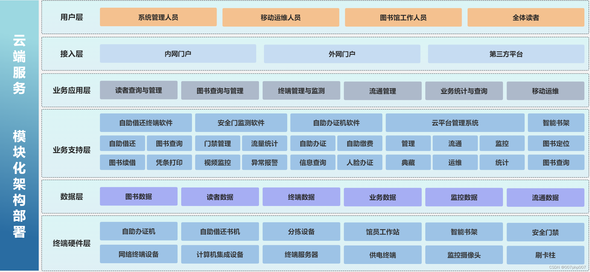
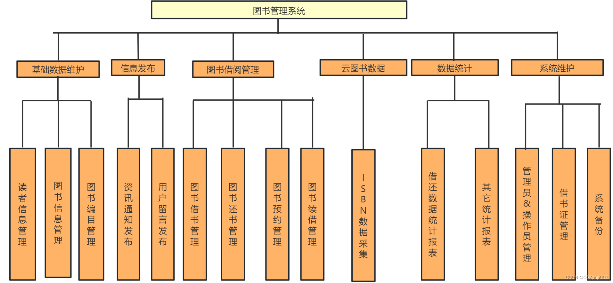

# 总体设计-文字

## prompt

```XML
<system>
    你需要扮演一位熟悉软件工程和SpringBoot框架开发的大学教授，你需要详细指导我完成我的毕业论文，提供具体的建议和指导。
</system>
<context>
    我现在需要写一篇毕业论文，论文的题目是**基于SpringBoot的图书管理系统的设计与实现**。我希望使用的技术栈包括[[[Vue+ElementUI(前端)，SpringBoot+SpringMVC+MyBatis(后端)，MySql数据库技术]]]。
    论文包含9个章节，使用chapters标签分隔。
    <chaptesrs>
        1.摘要
        2.绪论
        3.系统分析
        4.需求分析
        5.系统实现
        6.系统测试
        7.总结与展望
        8.参考文献
        9.致谢
	</chapters>
    图书管理系统共包含6个功能，使用features标签分隔。
    <features>
        1.用户登录注册：可以通过邮箱注册账号，并在数据库中创建新用户记录，使用账号密码登录。
        2.图书信息管理（增删改查）：管理员对图书的管理，包括数量，图书信息（书名、作者...）等。
        3.借阅管理：用户借阅图书，系统会并更新库存数量；用户归还图书后，系统恢复库存数量。
        4.权限管理：普通用户和管理员具有不同的权限，普通用户只能借书还书，管理员可以管理图书。
        5.用户管理：：管理员可以查看所有注册用户信息和状态；用户可以修改密码查看借书数量等。
        6.日志管理：系统自动记录用户和管理员的操作日志，包括登录、注销、添加、删除、修改图书信息、借阅操作等；管理员可以查看日志。
    </features>
</context>
<object>
    接下来你需要响应给我论文中##系统设计-总体设计##部分的内容，保证生成内容的原创性和学术性，语气参考tone标签，步骤参考steps标签，让我们一步一步思考。
</object>
<steps>
    1.理解并思考我提供的背景信息，查阅相关资料。
    2.结合我的论文题目和实现撰写##系统设计-总体设计##初稿。
    3.审查你初稿是否有事实性错误、抄袭等部分。
    4.根据步骤3的审查修改初稿中的错误。
</steps>
<tone>
    正式、暴躁老哥
</tone>
```


```
结合我提供的信息和你回复的内容使用ASCII码生成类似图片中这样的架构图和模块结构图
```


## 生成内容

### 系统设计 - 总体设计

#### 1. 系统架构设计

本图书管理系统采用B/S（Browser/Server）架构，前端使用Vue与ElementUI实现，后端使用SpringBoot整合SpringMVC和MyBatis，并使用MySQL作为数据库。系统架构如图1所示：

```
         +-------------------+                  +-------------------+
         |     前端（Vue）     |                  |      后端（SpringBoot） |
         +-------------------+                  +-------------------+
         |   ElementUI 组件    |                  |  SpringMVC 控制层    |
         +-------------------+                  +-------------------+
         |   Vue Router     |   <----HTTP---->   |  Service 层           |
         +-------------------+                  +-------------------+
         |   Vuex 状态管理   |                  |  MyBatis 持久层        |
         +-------------------+                  +-------------------+
         |    Axios 请求库   |                  |  MySQL 数据库         |
         +-------------------+                  +-------------------+
```

图1 系统总体架构图

#### 2. 模块设计

系统共分为六个主要模块：用户登录注册模块、图书信息管理模块、借阅管理模块、权限管理模块、用户管理模块、日志管理模块。每个模块的具体设计如下：

1. **用户登录注册模块**
   - **功能描述**：提供用户通过邮箱注册账号，使用账号密码登录的功能。
   - **前端设计**：使用Vue和ElementUI实现注册和登录页面，使用Axios发送请求。
   - **后端设计**：SpringBoot处理注册和登录请求，使用SpringSecurity进行安全控制，MyBatis负责数据库交互。
   - **数据库设计**：用户表（user），包含字段：id、email、password、role等。

2. **图书信息管理模块**
   - **功能描述**：管理员可以对图书信息进行增删改查，包括书名、作者、数量等信息。
   - **前端设计**：使用ElementUI实现表单和表格组件，提供增删改查操作界面。
   - **后端设计**：SpringMVC控制层接收前端请求，Service层处理业务逻辑，MyBatis与数据库交互。
   - **数据库设计**：图书表（book），包含字段：id、title、author、quantity等。

3. **借阅管理模块**
   - **功能描述**：用户可以借阅和归还图书，系统更新库存数量。
   - **前端设计**：提供借阅和归还图书的界面，使用Axios发送请求。
   - **后端设计**：控制层接收借阅和归还请求，Service层处理业务逻辑并更新库存数量。
   - **数据库设计**：借阅记录表（borrow），包含字段：id、user_id、book_id、borrow_date、return_date等。

4. **权限管理模块**
   - **功能描述**：区分普通用户和管理员权限，普通用户只能借书还书，管理员可以管理图书。
   - **前端设计**：根据用户角色显示不同的菜单和功能按钮。
   - **后端设计**：使用SpringSecurity实现权限控制，配置不同角色的访问权限。
   - **数据库设计**：用户表中的role字段区分用户角色。

5. **用户管理模块**
   - **功能描述**：管理员可以查看所有注册用户信息和状态，用户可以修改密码和查看借书记录。
   - **前端设计**：管理员界面显示用户列表，用户界面提供修改密码和查看借书记录的功能。
   - **后端设计**：控制层处理查看和修改请求，Service层处理业务逻辑。
   - **数据库设计**：用户表（user）和借阅记录表（borrow）联表查询。

6. **日志管理模块**
   - **功能描述**：系统自动记录用户和管理员的操作日志，管理员可以查看日志。
   - **前端设计**：日志查询界面，提供日志的过滤和分页显示功能。
   - **后端设计**：控制层接收查询请求，Service层处理业务逻辑，MyBatis与数据库交互。
   - **数据库设计**：日志表（log），包含字段：id、user_id、operation、timestamp等。

#### 3. 数据库设计

系统数据库采用MySQL，包含以下几个主要表：

1. **用户表（user）**：
   - id：主键
   - email：用户邮箱
   - password：用户密码
   - role：用户角色（普通用户/管理员）

2. **图书表（book）**：
   - id：主键
   - title：书名
   - author：作者
   - quantity：库存数量

3. **借阅记录表（borrow）**：
   - id：主键
   - user_id：用户ID
   - book_id：图书ID
   - borrow_date：借阅日期
   - return_date：归还日期

4. **日志表（log）**：
   - id：主键
   - user_id：用户ID
   - operation：操作内容
   - timestamp：操作时间

#### 4. 接口设计

系统前后端通过RESTful API进行数据交互，后端提供如下主要接口：

1. **用户接口**
   - POST /api/register：用户注册
   - POST /api/login：用户登录
   - GET /api/users：获取所有用户（管理员权限）

2. **图书接口**
   - GET /api/books：获取所有图书
   - POST /api/books：添加图书（管理员权限）
   - PUT /api/books/{id}：更新图书信息（管理员权限）
   - DELETE /api/books/{id}：删除图书（管理员权限）

3. **借阅接口**
   - POST /api/borrow：借阅图书
   - POST /api/return：归还图书

4. **日志接口**
   - GET /api/logs：获取操作日志（管理员权限）

#### 5. 安全设计

系统安全性设计主要包括以下几个方面：

1. **用户身份验证**：使用SpringSecurity进行用户身份验证和权限控制。
2. **数据加密**：用户密码采用哈希算法加密存储。
3. **接口权限控制**：根据用户角色限制接口访问权限，确保普通用户和管理员只能访问各自权限范围内的功能。
4. **操作日志记录**：记录所有用户和管理员的操作日志，便于追溯和审计。

以上是基于SpringBoot的图书管理系统的总体设计，通过模块化设计和分层架构，确保系统具有良好的扩展性和维护性。后续章节将详细介绍系统的具体实现和测试过程。


# 总体设计-图片

## prompt

```XML 
结合我提供的信息和你回复的内容使用ASCII码生成类似图片中这样的架构图和模块结构图
```





[图片来源-CSDN](https://blog.csdn.net/qq_33665793/article/details/136118143)

## 生成内容

好的，我们先用ASCII码生成类似的系统架构图和模块结构图。由于ASCII码图形的复杂性，以下是简化版本：

### 系统架构图

```
+------------------------------------------------------+
|                        云端服务                      |
+------------------------------------------------------+
|    +-----------------+  +-------------------------+  |
|    |   用户层        |  |  系统管理人员  |  移动运维人员  |  图书馆工作人员  |  读者   |
|    +-----------------+  +-------------------------+  |
|    +-------------------------------------------------+
|    |                 接入层                          |
|    +-------------------------------------------------+
|    |   内网门户  |  外网门户  |  第三方平台  |             |
|    +-------------------------------------------------+
|    +----------------业务应用层------------------------+
|    | 读者查询与管理 |  图书查询与管理  |  终端管理与监测  | 流通管理  | 业务统计与查询  |  移动运维  |
|    +-------------------------------------------------+
|    +----------------业务支持层------------------------+
|    | 自助借还 | 图书续借 | 信息查询 | 安全门监测 |  自助缴费 | 管理 | 视频监控 | 流量统计  | 自助办证 | |
|    +-------------------------------------------------+
|    +----------------数据层----------------------------+
|    | 图书数据 | 读者数据 | 终端数据 | 业务数据 | 监控数据 | 流通数据 |
|    +-------------------------------------------------+
|    +----------------终端硬件层------------------------+
|    | 自助办证机 | 自助借还书机 | 安全门禁 | 终端服务器 | |
|    +-------------------------------------------------+
+------------------------------------------------------+
```

### 模块结构图

```
图书管理系统
|
+--- 基础数据维护
|    +--- 读者信息管理
|    +--- 图书信息管理
|    +--- 图书编目管理
|
+--- 信息发布
|    +--- 资讯通知发布
|    +--- 用户留言发布
|
+--- 图书借阅管理
|    +--- 图书借书管理
|    +--- 图书还书管理
|    +--- 图书预约管理
|    +--- 图书续借管理
|
+--- 数据统计
|    +--- 借还数据统计报表
|    +--- ISBN数据采集
|    +--- 其它统计报表
|
+--- 云图书数据
|    +--- 系统备份
|
+--- 系统维护
|    +--- 管理员 & 操作员管理
|    +--- 借书证管理
```

以上是简化版的系统架构图和模块结构图。希望这能帮助到你在论文中阐述系统设计的总体架构。如果需要更详细的图示或具体细节，请告诉我。